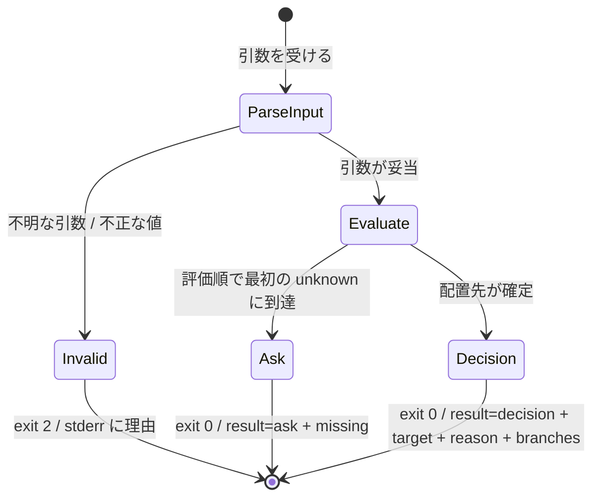

# Phase 1 Data Model: スキルとエージェントの配置判断フロー

**Feature**: `001-placement-decision-flow` | **Date**: 2026-09-12

本機能は永続化を行わない。ここで扱う「エンティティ」は、**実行時に受け渡される値**と
**ファイルとして存在する資材**の 2 種類である。前者は `decide.sh` の入出力契約の対象、
後者はテストと整合性確認の対象になる。

---

## 1. 値エンティティ（実行時に受け渡される）

### 1.1 ReplyValue（回答値）

| 値 | 意味 |
|---|---|
| `yes` | 該当する / 必要である |
| `no` | 該当しない / 必要でない |
| `unknown` | 未回答、または判断がつかない |

**検証規則**:

- 上記 3 値のいずれかでなければならない。それ以外は `decide.sh` が **exit 2** で拒否する
- 引数を省略した場合は `unknown` として扱う（エラーにしない）
- 大文字小文字は区別する（小文字のみ受理）

**根拠**: R-2。`unknown` を持つことで FR-006（不足時は問い返す）が表現でき、
`unknown` 以外を拒否することで憲章 III（fail-closed）を満たす。

---

### 1.2 Branch（判断分岐）

評価順序を持つ 4 つの質問。**順序は固定**（FR-021）。

| 順序 | フィールド名 | 質問 | 配置先が確定する条件 |
|---|---|---|---|
| 1 | `governance` | 実行前検証・権限・外部接続を伴うか | `yes` → `subagent-definition` |
| 2 | `orchestration` | タスクの分解・委任・統合か | `yes` → `orchestrator` |
| 3 | `reusable` | 他のサブエージェントでも使いそうか | `no` → `subagent-definition` |
| 4 | `needs_code` | 決定論的な実行コードが必要か | `yes` → `skill-scripts` / `no` → `skill-instructions` |

**検証規則**:

- 評価は 1 → 2 → 3 → 4 の順で行い、確定した時点で残りを評価しない（短絡）
- `unknown` に到達したら、その分岐で評価を止めて問い返しを返す
- 順序を入れ替えてはならない。順序が変われば同じ入力でも配置先が変わる（FR-008 / SC-010）

---

### 1.3 PlacementTarget（配置先）

| 値 | 対応する層・種別 | 成果物 |
|---|---|---|
| `orchestrator` | オーケストレーター | エージェント定義の本体（分解・委任・統合の責務） |
| `subagent-definition` | サブエージェント定義 | エージェント定義（`system prompt`・ガバナンス設定を含む） |
| `skill-instructions` | スキル（手順） | `SKILL.md` |
| `skill-scripts` | スキル（実行コード） | `scripts/` 配下のスクリプト |

**検証規則**:

- 上記 4 値のいずれかに限る（FR-002 の 3 層を、スキルの手順／コードで分けたもの）
- スキル内訳（`skill-*`）のときのみ、`scripts/` か `SKILL.md` かの区別を持つ（FR-003）

---

### 1.4 GovernanceItem（ガバナンス項目）

| 値 | 内容 |
|---|---|
| `pre_execution_check` | 実行前の検証（フック） |
| `permission` | 権限 |
| `external_connection` | 外部接続（`mcpServers`） |

**配置規則**: ガバナンス項目は**使い回せるかどうかに関係なく**サブエージェント定義側に置く
（FR-005 / FR-022）。スキルには置かない。

**根拠**: これらはエージェント定義の構造（フック・権限・`mcpServers`）に属する機能であり、
スキルの `SKILL.md` には対応する記述場所がない。判断表の最初のゲートに置くことで、
「使い回せるからスキル」という誤判定を構造的に防ぐ。

---

### 1.5 DecisionResult（判定結果）

判定コードの出力。**2 種類のいずれか**（FR-012: 判断を保留したまま終わらない）。

#### 1.5.1 `result=decision`

| フィールド | 型 | 内容 |
|---|---|---|
| `result` | 固定値 | `decision` |
| `target` | `PlacementTarget` | 配置先 |
| `reason` | 識別子 | 確定させた規則（下表） |
| `branches` | `key=value,...` | 実際に評価した分岐と回答（評価順） |

`reason` の値:

| `reason` | 確定条件 |
|---|---|
| `governance` | `governance=yes` |
| `orchestration` | `governance=no` かつ `orchestration=yes` |
| `reusable-with-code` | 上記以外で `reusable=yes` かつ `needs_code=yes` |
| `reusable-instructions` | 上記以外で `reusable=yes` かつ `needs_code=no` |
| `not-reusable` | 上記以外で `reusable=no` |

#### 1.5.2 `result=ask`

| フィールド | 型 | 内容 |
|---|---|---|
| `result` | 固定値 | `ask` |
| `missing` | フィールド名 | 回答が必要な分岐（例: `governance`） |

**検証規則**:

- 出力は `key=value` 形式の ASCII 行。1 フィールド 1 行
- 行の順序は固定（`result` → `target` → `reason` → `branches` / `result` → `missing`）
- `branches` には `unknown` の分岐を含めない（評価していないため）
- **`result=decision` で `reason` が `governance` のとき、`target` は必ず
  `subagent-definition`**（FR-022 の不変条件）
- `result=ask` のとき、`missing` は評価順序で最初に `unknown` に到達した分岐

---

### 1.6 SkillCandidate（既存スキル候補）

| フィールド | 型 | 内容 |
|---|---|---|
| `path` | 文字列 | **リポジトリ相対パス**（FR-007 / FR-020） |
| `name` | 文字列 | フロントマターの `name` |
| `description` | 文字列 | フロントマターの `description` |

**検出規則**（R-1 / R-7）:

- 対象リポジトリ内の `SKILL.md` を探索する。特定ディレクトリに依存しない（FR-010）
- `--query` を指定した場合、そのトークンが `name` または `description` に部分一致するものだけを返す
- 除外: `.git`、`node_modules`、`tmp`、`dist`、`build`、`vendor`、`.venv`、`venv`、`__pycache__`
- ドット始まりのディレクトリは除外しない（`.github/skills/` を対象に含めるため）
- 出力は `path` の昇順でソートする（決定性のため）
- 候補 0 件は正常終了（exit 0、出力なし）

**関係**: `SkillCandidate` は `PlacementTarget` が `skill-*` のときのみ参照される。
AI は候補の中からのみ再利用を提案できる（FR-009）。

---

### 1.7 ConventionPath（慣習ディレクトリ）

| フィールド | 型 | 内容 |
|---|---|---|
| `layer` | 列挙 | `skill` / `subagent`（オーケストレーターの置き場所は `subagent` として報告する） |
| `path` | 文字列 | リポジトリ相対パス |
| `exists` | 文字列 | `yes` / `no`（真偽値リテラル `true` / `false` ではない） |

**検出候補**（R-6）:

| `layer` | 候補パス |
|---|---|
| `skill` | `.github/skills/`、`plugins/*/skills/` |
| `subagent` | `.github/agents/`、`.claude/agents/` |

**検出規則**: 候補 4 件を**常に 4 行出力する**（実在しないものも `exists=no` として報告する。
不在であること自体が情報になるため）。出力順は `layer` → `path` の昇順。

---

## 2. ファイルエンティティ（リポジトリに存在する資材）

### 2.1 PluginManifest（`plugins/placement-decision-flow/plugin.json`）

| フィールド | 必須 | 値 |
|---|---|---|
| `$schema` | ✅ | `https://agent-plugins.org/schemas/1.0.0/plugin.schema.json` |
| `name` | ✅ | `placement-decision-flow` |
| `version` | ✅ | `1.0.0` |
| `description` | ✅ | 何をするプラグインか（1 文） |
| `author` | ✅ | 既存プラグインと同形式 |

**検証規則**（Agent Plugins §5.5 の閉じたスキーマ）:

- 上記以外のキーを追加してはならない
- `name` は `^(?!.*(?:--|\.\.))[a-z0-9](?:[a-z0-9.-]*[a-z0-9])?$` に一致し、1〜64 文字
- `.github/plugin/marketplace.json` に `source: plugins/placement-decision-flow` を登録する
  （憲章 VI。登録しないとクライアントから見えない）

---

### 2.2 SkillManifest（`skills/placement-decision-flow/SKILL.md`）

| フィールド | 必須 | 値 |
|---|---|---|
| `name` | ✅ | `placement-decision-flow`（**親ディレクトリ名と一致**） |
| `description` | ✅ | 何をするか + `Use when:` を含む英語トリガー（憲章 II） |
| `argument-hint` | — | 判断対象の処理を入力する旨（リポジトリの慣習） |

**検証規則**:

- `name` は親ディレクトリ名と完全一致すること（Agent Skills 仕様）
- `name` は小文字英数字とハイフンのみ、先頭と末尾は英数字、`--` を含まない、1〜64 文字
- `description` は 1〜1024 文字
- 本文は 500 行未満（Progressive Disclosure）
- ファイル参照はスキルルートからの相対パスで、1 階層までに留める

---

### 2.3 DecisionRuleRow（判断表の行 / `references/criteria.md`）

**`references/criteria.md` に固定書式の表として存在し、判断基準の単一の真実源となる**（R-9）。
**列の並びと 5 行の内容は [plan.md](./plan.md) の「Structure Decision」に定める。表そのものを
本ファイルに再掲しない**（二重定義を作らないため。内容の正は `references/criteria.md`）。

| 列 | 型 |
|---|---|
| `governance` | `yes` / `no` / `*` |
| `orchestration` | `yes` / `no` / `*` |
| `reusable` | `yes` / `no` / `*` |
| `needs_code` | `yes` / `no` / `*` |
| `target` | `PlacementTarget` |
| `reason` | 1.5.1 の `reason` と同じ識別子 |

`*` は「その列を評価しない」（短絡）を意味する。

**検証規則**:

- 5 行で構成される（重複した `reason` を持たない）
- 各行の `target` と `reason` の組合せが 1.5.1 の表と一致する
- **`tests/test_criteria_sync.sh` がこの表を読み取り、`decide.sh` の出力と照合する**。
  `*` の列には `yes` / `no` / `unknown` を流し込み、`target` が変わらないことを確認する
- 表の書式（列の順序・区切り）を変えるとテストが失敗する。これが同期の強制手段

---

## 3. 状態遷移（判定コードの実行）

判定コードは状態を持たないが、**終了コードが呼び出し側との契約**になる。

| 終了コード | 意味 | 標準出力 | 標準エラー出力 |
|---|---|---|---|
| `0` | 判定または問い返しを返した（正常） | `key=value` 行 | なし |
| `2` | 入力が不正（不明な引数・不正な値） | なし | 違反の理由 |

**検証規則**:

- `result=ask` は**正常終了**（exit 0）。判断の保留ではなく、正当な結果の 1 つ（FR-012）
- exit `1` は使わない（予期しない内部エラー専用に空けておく）
- 標準出力に `key=value` 以外の行を出してはならない（テストがパースするため）
- 出力は UTF-8 かつロケール非依存（憲章 VII）。ASCII の識別子のみを出力する
- 同じ入力に対して常に同じ出力（FR-008 / SC-006 / SC-010）
